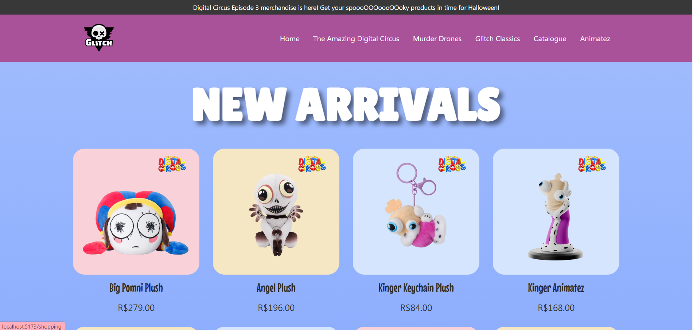
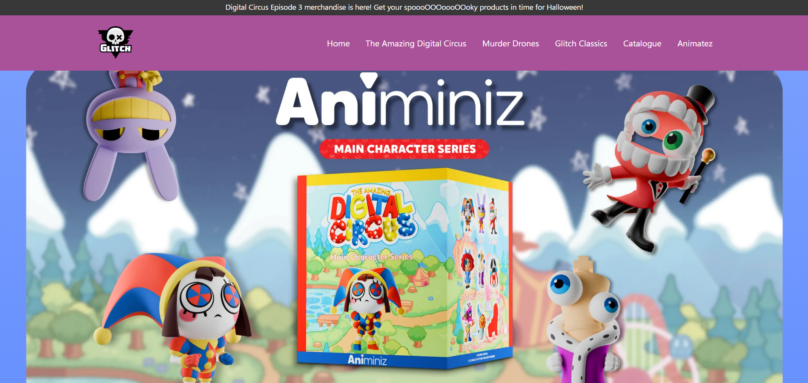
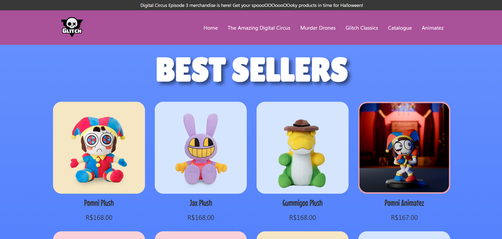
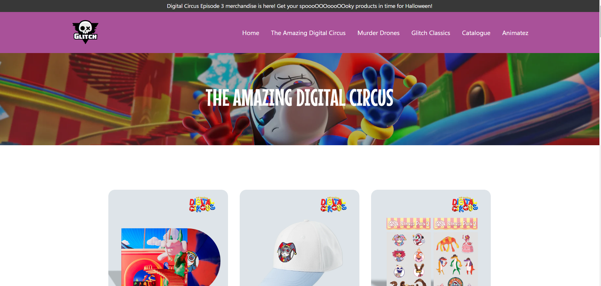

# `The Amazing Digital Circus`
## ⭐ Totalmente desenvolvido a partir do site oficial: [Glitch Productions Store](https://glitchproductions.store/pages/theamazingdigitalcircus)
> ### 🚀 Desenvolvido em React, consiste em uma loja virtual com alguns dos produtos da loja oficial Glitch. É possível visualizar os produtos, navegar pelo catálogo e selecionar determinado produto para visualização e compra.    Também pretendo adicionar um carrinho de compras
                                                                                                                                                                                                                                                                                              
⚠️ Trabalho atualmente nesse projeto

# 📍 `Home:`

## 👩‍💻 Primeira sessão de produtos:

## 👩‍💻 Segundo banner:

## 👩‍💻 Segunda sessão de produtos:

# 📍 `Calálogo:`

## 👩‍💻 Produtos:

